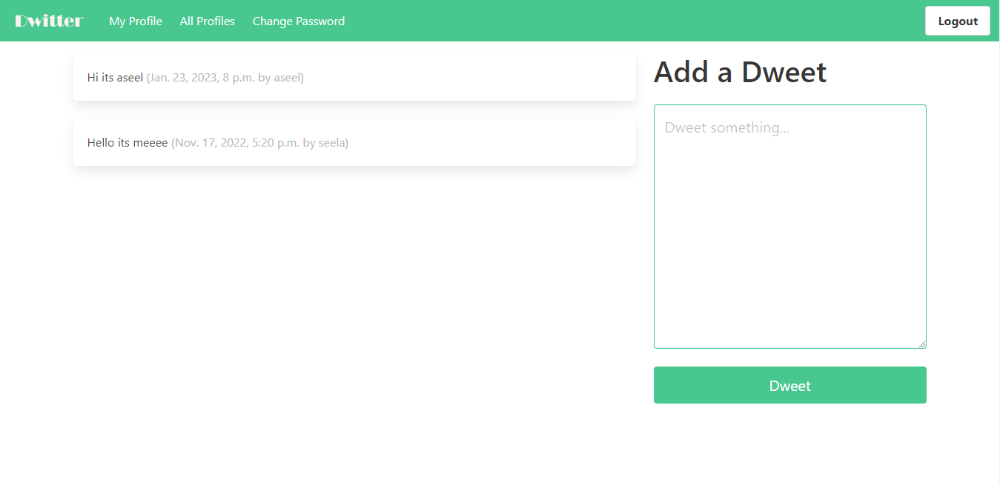

# Social Network web application
_Dwitter, a small social network web application ._

# Built with:
------------------
- Django
- HTML
- CSS (Bulma CSS framework)
- Sqlite3

# Features:
---------------------------------
User can:
- Create new account.
- Reset password.
- Change password.
- Login.
- Post short text-based dweet.
- Follow/ Unfollow other user profiles.
 

# screenshots:
---------------------------------
### Registration page

### Reset Password Page

### Change Password Page

### Login page

### Dashboard Page

### All profiles Page

### Profile Page:
